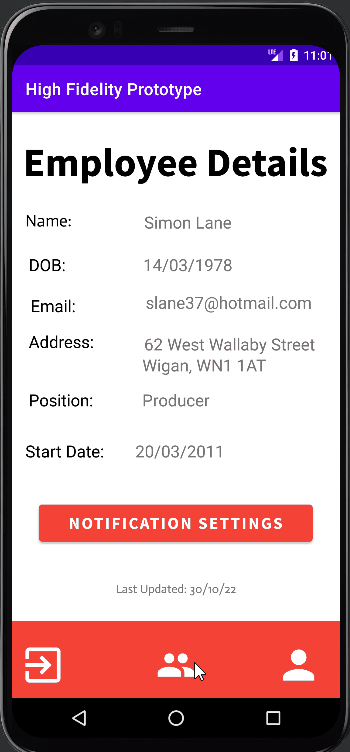

### Project Information
The implementation for the admin side of the employee management application. 
Allowing the user to perform CRUD operations on employees, manage notification preferences and authorize / deny holiday claims.
The android app developed in java uses volley to access the data on the RESTful API.
The app also contains the previously completed employee side, where once logged in, they can view their data, manage notifications and claim holiday.
### Key Features
The functionality of the admin side:
- Log in validation
- Can view all employees.
- Can create new employees.
- Can edit employee data.
- Can delete employees.
- Authorize holiday claims.
- Choose whether to get notifications for the above.

### Walkthrough

1. Enter the admin's credentials and press 'Log In'.
- The admin's account will be shown.
2. Select the 'Notification Settings' button.
3. Select what notifications you would like to receive.
4. Press 'Save'.


At the bottom of each window there is a navbar with 3 buttons: log out, employees, account. Each of these buttons will take the user to the related screen.
  - To log out, press the leftmost button.
  - To view a list of all employees, select the middle button.
  - To return to the screen that is shown after logging in, press the right button.

 There is a navigation bar at the bottom of every screen after logging in, where the user can switch between the accounts and holiday screens as well as the log out button.



To manage the employee data:
1. Select the middle option on the navbar, changing the screen.
2. A list of all stored employees will appear.

To insert an employee:
1. Press the button labelled "+".
2. Enter their first and last name as well as a random number.
3. The employee will be added to the database.
4. You will be returned to the list, and the employee will be shown on the list


To edit an employee:
1. Select an employee.
2. Enter their ID and updated name.
3. Press 'Update'.
4. The employee's data will be updated.


To delete an employee:
1. Select any employee.
2. Enter the intended employee's ID.
3. Press 'Delete'.
4. The employee will be removed, and the user will be returned to the employee list.
5. The removed employee will not be on the list.


To manage holiday requests:
1. Select an employee.
2. Press 'Approve' or 'Deny' to action their requests.
3. A notification will display, with the outcome of your choice.


### Potential Improvements
- Refine user interface.
- Improve log in functionality.
- Store dates for holiday claims.
- Store and edit additional data and add to the API.
- Refine the features of the employee side.


All vector images used in the application are from the built-in google material desing icons.
```
Written in Java using Android Studio 2022.
```

